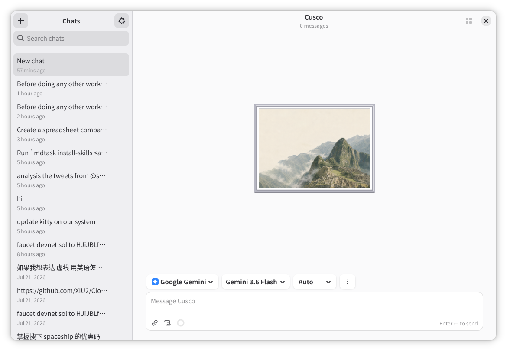

# Cusco

Cusco is a native GNOME AI chat application built with GJS, GTK 4, and libadwaita. It is an advanced desktop AI workspace that feels at home on GNOME: persistent conversations, provider switching, memory controls, local tools, reusable workspace assets, installed skills, and desktop integration.

> **Under development:** Cusco is not production-ready yet. Expect incomplete behavior, changing data formats, and rough edges while the app is actively built.



## Features

- Native GTK/libadwaita chat shell with a persistent conversation sidebar.
- Markdown transcript rendering with highlighted code blocks and copy actions.
- Durable, revisioned artifacts with inline previews, a native side workspace, typed data/chart views, and sandboxed HTML applications.
- Message edit, retry, regenerate, branch, archive, delete, search, and export workflows.
- Provider management for OpenAI, Anthropic, Gemini, Kimi, DeepSeek, Grok, Z.ai, and custom OpenAI-compatible APIs.
- Per-chat provider/model selection, model discovery, response timeouts, and optional provider fallback.
- Secret Service API key storage, with environment variables as a development fallback.
- User-approved memory proposals, per-chat memory controls, memory management, import/export, and visible audit notes.
- Built-in tools for web search, calculator, structured data summaries, file context, and image attachment notes.
- Workspace preferences for prompt snippets, agent profiles, conversation folders/tags, plugin tool descriptors, hooks, and computer-use controls.
- SKILL support from `~/.agents/skills`, the repository `skills/` folder, and installed plugins, managed beside the plugin catalog with per-chat skill selection.
- Native standalone plugin, Skill, and MCP management with header tabs, marketplace search, manifest metadata, and confirmed install or removal actions.
- Optional Linux-only computer use for window capture, pointer/keyboard actions, and GNOME workspace switching on Wayland.
- GNOME integration through app actions, keyboard shortcuts, notifications, adaptive layout, high contrast/reduced motion settings, desktop actions, and Shell search provider support.

## Current Status

Cusco is still a development project, but the main local app surfaces are implemented. OpenAI, Anthropic, Gemini, and compatible providers stream network responses directly into the native GTK transcript.

See [TODO.md](TODO.md) for the roadmap and [docs/user/getting-started.md](docs/user/getting-started.md) for workflow details.

## Install on Fedora

Cusco is available from the third-party [`stonegate/cusco` Fedora COPR repository](https://copr.fedorainfracloud.org/coprs/stonegate/cusco/) for supported Fedora releases and Rawhide on x86_64 and aarch64.

Enable the repository and install Cusco:

```sh
sudo dnf copr enable stonegate/cusco
sudo dnf install cusco
```

Future Cusco releases are delivered through normal Fedora updates. To update immediately:

```sh
sudo dnf upgrade cusco
```

To remove Cusco and disable its repository:

```sh
sudo dnf remove cusco
sudo dnf copr disable stonegate/cusco
```

## Requirements

Install the GNOME JavaScript and build tooling for your distro.

Fedora:

```sh
sudo dnf install gjs gtk4 libadwaita gtksourceview5 webkitgtk6.0 libsecret libsoup3 meson ninja-build desktop-file-utils appstream glib2-devel
```

Ubuntu/Debian:

```sh
sudo apt install gjs gir1.2-gtk-4.0 gir1.2-adw-1 gir1.2-gtksource-5 gir1.2-webkit-6.0 gir1.2-secret-1 gir1.2-soup-3.0 meson ninja-build desktop-file-utils libglib2.0-dev
```

## Run From Source

```sh
gjs -m src/main.js
```

Configure remote providers from Preferences. API keys are stored through Secret Service; for local development, provider-specific environment variables can also be used.

Skills are discovered from global, Cusco repository, and installed-plugin folders:

```sh
~/.agents/skills/<skill-id>/SKILL.md
$REPO_ROOT/skills/<skill-id>/SKILL.md
$REPO_ROOT/plugins/<plugin-id>/skills/<skill-id>/SKILL.md
```

The **Plugins → Skills** tab labels each entry as **Global** or **Cusco**. Adding a
skill copies its complete folder into `$REPO_ROOT/skills/`; the original folder
is left unchanged. Enable skills there, then select them from the composer skill
menu for a chat. Cusco sends selected skills as instruction context and records
a visible transcript note; it does not execute skill files.

Cusco also ships compact built-in MCP setup guidance that is always available to the model. The repo includes the longer reference/installable version at [examples/skills/cusco-mcp-setup/SKILL.md](examples/skills/cusco-mcp-setup/SKILL.md).

The Plugins destination provides **Plugins**, **Skills**, and **MCP** header tabs.
The Plugins tab reads Cusco's own `$REPO_ROOT/.agents/plugins/marketplace.json`
catalog and each plugin manifest directly. Install copies the complete plugin
into `$REPO_ROOT/plugins/`; removal deletes only the Cusco-managed repository
copy. Connector-backed plugins normally use Cusco's native MCP client and OAuth
flow, with discovery, PKCE, confidential or public client registration,
automatic refresh, and tokens stored in Secret Service. The complete flow and
[configuration options are documented in MCP Authorization](docs/implementation/mcp-authorization.md). Gmail instead
binds directly to a Google account in GNOME Online Accounts: GOA retains the
credentials, while
Cusco stores only the selected account ID and uses the GOA-provided secure IMAP
configuration to expose bounded, permission-gated read tools without a hosted
connector intermediary.

## Build

```sh
meson setup builddir
meson compile -C builddir
```

To install Cusco for the current user only:

```sh
scripts/install-user.sh
```

This installs under `$HOME/.local` without `sudo` and does not change the
system-wide installation.

## Test

```sh
scripts/check.sh
```

Some smoke tests skip automatically when the current environment has no display server or disallows local sockets.

## Documentation

- [Architecture](docs/design/architecture.md)
- [Setup](docs/implementation/setup.md)
- [Chat Switching Performance](docs/implementation/chat-performance.md)
- [User Getting Started](docs/user/getting-started.md)
- [Lifecycle Hooks](docs/user/hooks.md)
- [Lifecycle Hook Architecture](docs/implementation/hooks.md)
- [Artifacts](docs/user/artifacts.md)
- [Image Viewer and Editor](docs/user/image-editor.md)
- [Artifact Architecture and Security](docs/implementation/artifacts.md)
- [Image Editor Architecture](docs/implementation/image-editor.md)
- [Computer Use](docs/user/computer-use.md)
- [Computer-Use Architecture](docs/implementation/computer-use.md)
- [Provider Models](docs/user/provider-models.md)
- [MCP Authorization](docs/implementation/mcp-authorization.md)

## License

Cusco is licensed under the GNU General Public License v3.0 or later. See [LICENSE](LICENSE).
