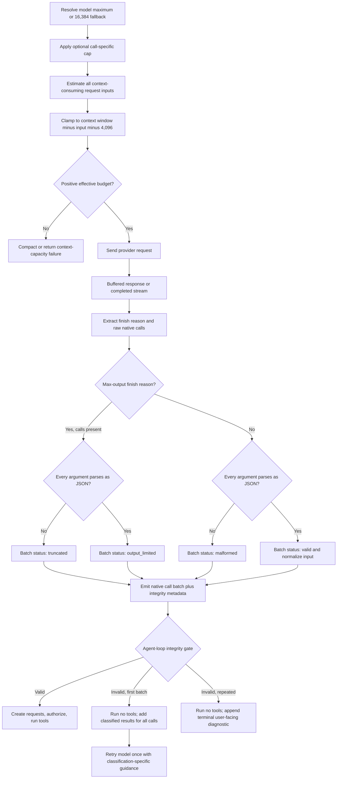

# Output-Aware Native Tool-Call Recovery - Plan

## Goal Capsule

- **Objective:** Reduce avoidable truncation with model-aware output budgets, prevent incomplete or malformed native tool-call arguments from reaching tool execution, distinguish output-limit truncation from ordinary malformed JSON, and give an agent exactly one safe recovery attempt before stopping with an actionable message.
- **Authority hierarchy:** The user-approved scope and recovery policy in this plan take precedence; repository `AGENTS.md` constraints and the existing provider/tool architecture govern implementation details; current tests and code behavior define compatibility requirements where this plan is silent.
- **Execution profile:** Code change across model metadata/output-budget resolution, the shared OpenAI-compatible provider boundary, and agent-mode orchestration. U1 and U4 may proceed independently; U2 follows U1, and U3 closes after U1, U2, and U4. Preserve the current worktree's in-progress streaming transport changes.
- **Stop conditions:** Stop and re-plan if a provider cannot receive a protocol-valid failed tool result for every rejected call, if any invalid batch can cause a tool side effect before validation, or if the change would require a new artifact upload/chunking protocol.
- **Tail ownership:** U3 owns cross-transport regression coverage, the user-facing changelog entry, the final smoke suite, and removal of any abandoned implementation paths.

## Product Contract

### Summary

Cusco currently applies a global 8,192-token output default, converts native tool-call argument text into a tool input even when `JSON.parse` fails, and emits tool calls before considering a max-output finish reason. When an OpenAI-compatible model reaches its output limit while generating a large argument object, the partial string therefore reaches tools such as `artifact_create`, which can only report the technically correct but misleading error `input must be valid JSON`. The fix must resolve output capacity from the selected model and remaining context, reject incomplete calls before any tool runs, explain whether the provider stopped at its output limit or returned malformed input, and let the agent retry once with a smaller request.

### Problem Frame

The saved Kimi conversation showed three failed `artifact_create` calls whose argument strings ended inside the open `content` string. Each string became valid JSON after adding only the missing closing quote and brace, so the failure was genuine truncation rather than special-character corruption. `src/providers/outputLimits.js:1` currently supplies a global 8,192-token default, despite model-specific context metadata already existing in `src/providers/config.js`. The shared parser at `src/providers/remoteProvider.js:1101` catches parse errors and returns the raw text; `RemoteProvider.streamChat()` emits tool calls before considering a max-output finish reason at `src/providers/remoteProvider.js:2970`; `_runAgentModeResponse()` then creates and runs each request at `src/window.js:5644`. The fixed global budget can cause avoidable truncation, while the response ordering allows any remaining incomplete call to cross the side-effect boundary.

### Actors

- A1. **Cusco user:** asks an agent to perform work and needs an accurate, bounded failure instead of repeated opaque JSON errors.
- A2. **OpenAI-compatible model/provider:** emits buffered or streamed native tool calls and a terminal finish reason.
- A3. **Cusco agent loop:** interprets the provider response, maintains protocol-compatible runtime history, and decides whether to execute, recover, or stop.
- A4. **Cusco tool runtime:** validates permissions and tool-specific inputs and must only receive complete native calls.

### Requirements

#### Provider response integrity

- R1. Cusco must validate the raw JSON argument string of every native tool call before converting it to the tool's string input.
- R2. A response that contains native tool calls and terminates for a max-output reason must reject the entire call batch. If any argument is unparseable, classify it as `truncated`; if all arguments parse, classify it as `output_limited` and explain that the batch was rejected conservatively without claiming the arguments themselves were incomplete.
- R3. A terminal native tool-call response whose argument string does not parse as JSON must classify the entire call batch as `malformed`.
- R4. The integrity classification must work for buffered and streamed OpenAI-compatible Chat Completions responses and for OpenAI Responses API calls whose arguments arrive as raw JSON text.
- R5. A rejected native tool-call batch must be fail-closed: no call in that batch may reach request creation, permission prompts, or tool execution. Raw call stubs must remain detectable through classification before blank-name filtering; if Cusco cannot construct protocol-valid failure pairing for a partial unnamed call, it must stop safely rather than ignore or execute the batch.

#### Recovery and user feedback

- R6. On the first rejected native tool-call batch in a user turn, Cusco must add protocol-compatible failed tool results for every call in the batch and allow one further model iteration. Each result must distinguish a call with invalid arguments from a valid sibling that was not executed because the batch was rejected atomically.
- R7. The first recovery prompt must give classification-specific correction: `truncated`/`output_limited` batches should reduce or split the payload, while `malformed` batches should regenerate complete valid JSON without repeating the malformed structure. For mixed batches, it must tell the model to reissue every still-intended call.
- R8. If another native argument-integrity failure occurs in the same user turn, Cusco must stop immediately, show an actionable user-facing message, and not consume the remaining general agent iteration budget.
- R9. The recovery allowance is counted per rejected batch, not per call, and applies only to native argument-integrity failures; ordinary tool validation errors, permission denials, cancellations, and tool runtime failures retain their existing behavior.

#### Compatibility

- R10. Valid native tool calls, including the existing single-key `{"input":"..."}` unwrapping convention, must execute exactly as before.
- R11. Text-only responses stopped at the output limit must retain the existing automatic continuation behavior.
- R12. Anthropic and Gemini structured tool-input paths must not be behaviorally changed by this fix unless a shared type-preservation change is required to keep their current output intact.
- R13. The artifact tool's strict JSON parser remains a final defensive check; this fix must not relax it or synthesize missing braces, quotes, or content.

#### Model-aware output budgets

- R14. Every selected model must resolve a configured maximum output-token value: built-in models use their declared metadata, while custom or discovered models without an explicit value default to 16,384 tokens.
- R15. Custom/discovered model records must accept and persist an explicit `maxOutputTokens` override alongside `contextWindowTokens`; no new app-wide setting or settings UI is required.
- R16. Immediately before every provider request, including internal continuation and integrity-recovery iterations, Cusco must compute `effectiveMaxOutputTokens = min(configuredMaxOutputTokens, contextWindowTokens - estimatedInputTokens - 4096)` when the model has a known context window. `estimatedInputTokens` must cover the complete request inputs that consume context—not only messages, but also system framing, serialized native/client tool definitions, and attachment accounting. A call-specific cap such as compaction must participate as an additional upper bound.
- R17. If the context window is unknown, Cusco must use the configured model maximum. If the calculated remaining budget is non-positive, it must not raise the result to the existing 1,024-token normalization minimum or dispatch a request. The provider layer must raise a typed, local, non-retryable capacity error; provider fallback must not handle that error. Cusco may use its existing pre-turn compaction attempt, but mid-turn exhaustion must stop with the capacity diagnostic rather than introduce a new mid-turn compaction flow.
- R18. Provider request builders must serialize the already-resolved effective value using their existing API-specific field (`max_output_tokens`, `max_completion_tokens`, `max_tokens`, or `generationConfig.maxOutputTokens`) without replacing it with a global default or increasing it during normalization. If Anthropic fixed-budget thinking plus its required response allowance cannot fit under the effective cap, Cusco must return the same typed capacity error before dispatch; it must neither raise `max_tokens` nor silently reduce the user's selected thinking level.

### Flows

- F1. **Valid native call:** Provider emits complete arguments and a normal tool-call finish reason → provider boundary marks the batch valid → agent loop creates requests → normal permission and execution flow runs.
- F2. **Output-limited native call:** Provider streams or returns a native call and stops for max output → provider boundary marks unparseable arguments `truncated` or a parseable but conservatively rejected batch `output_limited` → agent loop executes nothing → it records failed results for all calls and retries once with a smaller-payload instruction.
- F3. **Malformed terminal call:** Provider reports a completed tool-call response but one argument string is invalid JSON → provider boundary marks the batch malformed → agent loop follows the same single-recovery path with a malformed-input-specific explanation.
- F4. **Repeated integrity failure:** A second `truncated`, `output_limited`, or `malformed` batch occurs in the same user turn → agent loop executes nothing, appends a terminal diagnostic, and returns control to the user.
- F5. **Request budget resolution:** Immediately before each transport dispatch, Cusco resolves the selected model's configured output maximum, estimates all context-consuming request inputs, reserves 4,096 context tokens, and sends the smallest applicable positive upper bound; insufficient capacity or an incompatible Anthropic thinking budget produces a typed local capacity failure before network dispatch and without provider failover.

### Acceptance Examples

- AE1. Given a Kimi-style streamed `artifact_create` call whose `content` value ends mid-string and whose finish reason is `length`, Cusco emits no executable tool request, records a truncation-specific failed result, and asks the model to retry once with a smaller payload.
- AE2. Given another incomplete native call after AE1 in the same user turn, Cusco does not run a tool or start a third recovery; it stops with a message explaining that the provider repeatedly failed to finish the tool input.
- AE3. Given invalid JSON arguments with a terminal `tool_calls` finish reason, Cusco classifies the batch as malformed rather than truncated and performs the same one-time recovery.
- AE4. Given a batch containing one valid call and one invalid call, Cusco runs neither call and creates a failed result for each call ID. The invalid call's result identifies its argument error; the valid sibling's result says it was withheld by atomic batch rejection and should be reissued if still intended.
- AE5. Given a valid call with arguments `{"input":"2 + 2"}`, the downstream tool still receives `2 + 2` and executes normally.
- AE6. Given a text-only response ending with `length`, Cusco continues the response through the existing continuation loop and does not enter native tool recovery.
- AE7. Given a custom/discovered model with no declared output limit and enough remaining context, Cusco requests at most 16,384 output tokens.
- AE8. Given a model configured for 32,768 output tokens, a 100,000-token context window, and 80,000 estimated input tokens, Cusco requests at most 15,904 output tokens (`100,000 - 80,000 - 4,096`).
- AE9. Given a known context window with no positive budget after the 4,096-token reserve, Cusco compacts or returns the existing context-capacity failure before provider dispatch instead of forcing a 1,024-token request.
- AE10. Given an explicit 4,096-token cap for an internal summary request and a larger model/context allowance, Cusco keeps the effective request at 4,096 tokens.
- AE11. Given an agent request whose serialized tool definitions consume more than the 4,096-token reserve would absorb, Cusco includes that overhead in `estimatedInputTokens` and clamps or rejects the request before dispatch rather than relying on the reserve alone.
- AE12. Given an Anthropic fixed thinking budget plus required response allowance that exceeds the effective output cap, Cusco returns a local capacity diagnostic without raising `max_tokens`, reducing the selected thinking level, or trying another provider.

### Success Criteria

- No invalid or output-limited native argument batch crosses the tool execution boundary in automated regression tests.
- Exactly one provider retry occurs for an argument-integrity failure in a user turn, including when the first failure lands on the final ordinary agent iteration; a repeated failure stops deterministically.
- The visible failure accurately distinguishes incomplete arguments, conservative rejection of a parseable output-limited batch, and malformed JSON without blaming Unicode, special characters, or the artifact tool.
- Existing valid tool-call and text-continuation tests remain green across buffered and streaming transports.
- Built-in model limits, the 16,384 custom/discovered fallback, persisted overrides, remaining-context clamping, and non-positive-budget handling are covered by deterministic tests.

### Scope Boundaries

**In scope**

- Shared handling for OpenAI-compatible providers, including Kimi, DeepSeek, Z.ai, custom Chat Completions endpoints, and the OpenAI Responses raw-argument path.
- Model-level output limit metadata and overrides, a 16,384 fallback for custom/discovered models, and remaining-context-aware request budgeting across supported provider request formats.
- Internal tool-call integrity metadata, atomic batch rejection, bounded agent recovery, user-facing diagnostics, regression tests, and changelog documentation.

**Out of scope**

- Treating a larger or dynamic token budget as sufficient without the provider-boundary integrity gate.
- Repairing partial JSON by appending guessed quotes, braces, or content.
- Introducing chunked artifact creation, file import, or a new large-payload tool protocol.
- Changing tool permission semantics, the general agent iteration limit, or non-native `<cusco_tool_call>` parsing.
- Broadly redesigning Anthropic or Gemini tool invocation formats.

### Dependencies

- The existing max-output reason normalization in `src/providers/remoteProvider.js` remains the source of truth for recognizing output-limit termination.
- The existing native runtime-history builders in `src/chat/agentMode.js` remain responsible for provider-compatible assistant/tool message pairing.
- The in-progress streaming transport implementation in `src/providers/remoteProvider.js` and `tests/remote-provider-http-smoke.js` must be preserved and extended rather than replaced.

## Planning Contract

### Key Technical Decisions

- KTD1. Enforce argument integrity at the shared OpenAI-compatible provider boundary, not inside `artifact_create`. (session-settled: user-approved — chosen over an artifact-only patch: the same truncated argument can target any native tool, so safety belongs before tool dispatch.) Governs R1–R5 and R10–R13.
- KTD2. Carry an explicit internal batch status of `valid`, `truncated`, `output_limited`, or `malformed` alongside normalized calls. Invalid JSON plus a max-output reason is `truncated`; parseable JSON plus max output is `output_limited` and remains conservatively non-executable; invalid JSON after a completed tool-call response is `malformed`. Governs R1–R4.
- KTD3. Treat a batch atomically when integrity is uncertain: if the terminal reason or any member invalidates the batch, execute none of its calls and generate one failed result per call ID. This prevents partial side effects and preserves the provider's requirement that each assistant tool call receive a matching result. Governs R2–R6 and AE4.
- KTD4. Permit one bounded corrective model iteration per user turn, then stop on the next integrity failure. The corrective slot is separate from the ordinary agent-iteration budget so a failure on the final normal iteration still receives the promised retry. (session-settled: user-approved — chosen over stopping immediately: one retry can recover by reducing the payload while a hard cap prevents the repeated Kimi failure loop.) Governs R6–R9.
- KTD5. Keep transport classification in `src/providers/remoteProvider.js`, reusable recovery-message/policy helpers in `src/chat/agentMode.js`, and the per-turn counter plus side-effect gate in `src/window.js`. This matches existing ownership and keeps orchestration testable without moving provider logic into the UI layer. Governs R1–R9.
- KTD6. Preserve the raw provider argument text only as internal diagnostic/runtime-history data; never reinterpret it as executable tool input after a parse failure. Bound any user-visible preview, and do not persist duplicate full payloads solely for diagnostics. Governs R1, R6, R7, and R13.
- KTD7. Resolve output limits per model, default unspecified custom/discovered models to 16,384, and clamp every request to the remaining context after a 4,096-token reserve. (session-settled: user-directed — chosen over the current single global 8,192-token default: model capabilities differ and the remaining context is the actual hard constraint.) Governs R14–R18 and AE7–AE12.

### High-Level Technical Design



### Internal Contract

The provider layer should expose enough information for orchestration to make a decision without reparsing provider payloads. The exact property names may follow local naming conventions, but the normalized batch must represent:

- the raw call entry, including ID and any available name, before blank-name filtering;
- normalized `input` only when arguments parsed successfully;
- raw argument text for protocol history/diagnosis when parsing failed;
- one batch-level integrity status and reason derived after the terminal finish reason is known;
- the existing provider finish reason, text, reasoning, usage, and provider parts unchanged.

Immediately before each provider transport call, output-budget resolution should use the selected model record already returned by `ProviderConfigStore.resolve()` and an estimate of the complete request inputs that will consume context: converted messages and system framing, serialized native/client tool definitions, and attachment accounting. The configured limit is the minimum of an optional call-specific cap and `model.maxOutputTokens` (falling back to 16,384). When `contextWindowTokens` is known, the resolver applies the 4,096-token reserve and full request-input estimate as a hard upper bound. Configured-limit normalization and effective-budget clamping must remain separate so a minimum intended for saved configuration cannot increase a small remaining runtime budget.

`RemoteProvider.streamChat()` must resolve this budget afresh immediately before every `_complete` or `_streamComplete` dispatch, including its internal text-continuation requests; agent recovery naturally re-enters through the same boundary. A non-positive result raises a typed local capacity error before transport. `_collectProviderResponseWithFallback()` must recognize that error as non-retryable and bypass provider fallback. Existing pre-turn auto-compaction remains the only compaction attempt in this change; capacity exhausted by continuation or recovery history stops locally with the diagnostic instead of adding a mid-turn compaction lifecycle.

Anthropic fixed-budget thinking adds a coupled provider constraint: if `thinking.budget_tokens` plus the provider-required response allowance cannot fit inside the resolved effective cap, the request builder must return the same typed capacity error. It must not preserve protocol validity by increasing `max_tokens`, and it must not silently change the thinking level the user selected.

For streaming Chat Completions, argument deltas continue to accumulate in `ChatCompletionStreamState`; classification happens only after the final response supplies the finish reason. For buffered responses, the same helper receives the already-complete response. The two paths must converge before `RemoteProvider.streamChat()` decides whether to emit an executable batch.

The agent loop must check integrity before `_createAgentToolRequest()`. On the first invalid batch it constructs protocol-compatible history containing the assistant tool-call batch plus a classified failed `tool` message for every call ID, then spends the dedicated integrity-retry slot without consuming the ordinary iteration budget. On the repeated invalid batch it records a visible system diagnostic and returns without creating runtime requests or permission prompts.

### Agent-Native Planning Assessment

- **Applicability:** Required. This change directly modifies agent-generated tool calls, autonomous retry behavior, and the trust boundary before tools can produce side effects.
- **Action parity:** No new user or agent capability is added. Valid agent tool access remains unchanged; recovery is added only to keep native invocation safe and intelligible.
- **Execution lifecycle:** The recovery counter is local to one `_runAgentModeResponse()` invocation, survives intervening valid agent iterations within that turn, has one slot independent of the ordinary iteration counter, and resets for the next user turn.
- **Context parity:** The agent's output budget is computed from the selected model metadata and every context-consuming request component; recovery requests are recalculated after failure history is added.
- **Trust and control:** Invalid batches cannot reach request creation, permission UI, or execution. Existing approval gates remain authoritative for valid calls.
- **Agent-native testing:** Tests must assert outcomes—zero tool execution, correct failed-result pairing, exactly one retry, deterministic stop—not merely the presence of a status field.

### Implementation Constraints

- At plan creation, `src/providers/remoteProvider.js`, `src/window.js`, `tests/remote-provider-http-smoke.js`, and other files already contain user-owned uncommitted changes. Inspect and layer onto those diffs; do not reset, replace, or reformat unrelated work.
- Keep provider-specific details behind the existing shared provider abstractions.
- Do not add a settings toggle or schema migration; the behavior is a safety invariant.
- Treat `maxOutputTokens` as model metadata, including persisted custom/discovered model overrides, rather than an app-wide preference. Populate built-in values from authoritative provider model metadata; when a value is unavailable, use the documented 16,384 fallback instead of guessing.
- Error strings shown in the conversation should be concise and actionable. Full raw arguments must not be dumped into the UI.
- Preserve generated call IDs for provider history; synthesize an ID using the existing pattern only when the provider omitted one.

### Sequencing

1. U1 and U4 can establish the provider-integrity and model-budget contracts independently.
2. U2 adds the pre-execution recovery gate and pure recovery helpers against U1.
3. U3 exercises the combined request-budget, buffered, streamed, and recovery paths, updates the changelog, and runs the focused plus global smoke checks.

### System-Wide Impact

- **Providers:** Every Chat Completions–compatible provider inherits the safer behavior. OpenAI Responses uses the same integrity vocabulary for raw argument strings. Anthropic and Gemini remain unchanged because they deliver structured inputs.
- **Model catalog:** Built-in, discovered, and custom text-model records gain an output-limit field that must survive normalization, resolution, and persistence.
- **Request sizing:** All supported provider formats receive a model/context-aware effective output cap based on complete context-consuming request inputs; internal call-specific caps remain upper bounds.
- **Streaming:** A final finish reason now participates in tool-call validity; delta assembly alone is insufficient to authorize execution.
- **Agent runtime history:** Rejected batches add synthetic failure results so the provider can legally continue from its own tool-call IDs.
- **Tool safety:** Request validation, authorization prompts, and side effects occur only after the new integrity gate.
- **Conversation UX:** Users see a provider/output explanation and bounded retry instead of repeated artifact-level JSON errors.
- **Persistence/configuration:** No conversation schema, settings schema, secret storage, or installed application changes are required.

### Risks & Mitigations

- **Provider history rejection:** Some OpenAI-compatible endpoints may be strict about assistant tool-call history. Build failed-result batches through the existing runtime serializers and cover the exact outbound shape in adapter tests.
- **Mixed batch side effects:** Executing valid siblings before discovering an invalid call would be irreversible for some tools. Classify the complete batch before dispatch and reject it atomically.
- **False truncation on parseable prefixes:** A `length` finish reason can accompany an apparently valid call while another part is incomplete. Prefer the conservative whole-batch truncation rule and test it explicitly.
- **Retry context inflation:** Re-including a large partial argument can contribute to another failure. Keep visible diagnostics bounded and instruct the model to reduce/split payload; do not duplicate the raw text beyond what protocol history requires.
- **Incorrect model metadata:** A limit above the provider's real capability can still truncate or be rejected, while an unnecessarily low value wastes capacity. Source built-in limits from authoritative provider metadata, keep the 16,384 fallback explicit, and retain the fail-closed recovery layer as the correctness backstop.
- **Estimator error:** Local token estimation is approximate. The 4,096-token reserve absorbs normal drift; a non-positive budget must raise the typed local capacity error rather than be rounded upward.
- **Large dynamic tool schemas:** MCP/native tool definitions can exceed the fixed reserve. Include their serialized size in the request-input estimate and cover an overhead-above-reserve case in tests.
- **Thinking-budget conflict:** Anthropic fixed-budget thinking may not fit in a small effective cap. Fail locally before dispatch instead of increasing the hard cap or silently changing the user's selected thinking level.
- **Regression against active streaming work:** The relevant provider and HTTP test files are already modified. Make surgical edits and review the final diff against the pre-existing worktree state.

### Sources / Research

- `src/providers/remoteProvider.js:1101` — parse failures currently fall back to returning raw argument text.
- `src/providers/outputLimits.js:1` — current output budgeting is a global 8,192 default with a 1,024–32,768 normalization range.
- `src/providers/config.js:737` and `src/providers/config.js:768` — model metadata and persisted/discovered normalization already carry `contextWindowTokens`, providing the pattern for `maxOutputTokens`.
- `src/window.js:2964` and `src/window.js:5386` — Cusco already estimates conversation usage and resolves the provider/model before streaming, which is the integration point for remaining-context clamping.
- `src/providers/remoteProvider.js:1491` — Chat Completions calls are normalized without argument-validity metadata.
- `src/providers/remoteProvider.js:2238` — finish reason and calls are available together when the final response is normalized.
- `src/providers/remoteProvider.js:2970` — tool calls are emitted before the max-output continuation check.
- `src/window.js:5540` — the per-user-turn native agent loop and natural home of the bounded recovery counter.
- `src/window.js:5644` — native calls currently flow directly into request creation/execution.
- `src/window.js:5914` — collection options pass the call-specific output cap and selected thinking level into the provider path.
- `src/providers/remoteProvider.js:2121` — Anthropic currently raises `max_tokens` above a conflicting fixed thinking budget, which the effective hard-cap contract must replace with a pre-dispatch capacity error.
- `src/chat/agentMode.js:197` and `src/chat/agentMode.js:206` — existing corrective failure prompts and provider-compatible native failure messages.
- `tests/remote-provider-adapters-smoke.js:705` and `tests/remote-provider-adapters-smoke.js:872` — existing finish-reason, extraction, and continuation regression patterns.
- `tests/remote-provider-http-smoke.js` — current local SSE fixtures cover provider stream assembly and are the correct location for a truncated streamed-call regression.
- Observed failure evidence from 2026-08-09 — three consecutive Kimi `artifact_create` argument strings ended inside an open JSON string and became parseable only after supplying the missing JSON terminator.

## Implementation Units

### U1. Add native argument-integrity classification at the provider boundary

- **Goal:** Produce a normalized native call batch that is explicitly valid, truncated, output-limited, or malformed before it leaves the provider layer.
- **Requirements:** R1–R5, R10–R12; AE3–AE6.
- **Files:** `src/providers/remoteProvider.js`, `tests/remote-provider-adapters-smoke.js`.
- **Dependencies:** None.
- **Approach:**
  - Replace the parse-error raw-text fallback with a helper that returns parsed/normalized input plus parse status and raw argument text where needed.
  - Use one batch classifier after finish-reason extraction so max-output termination rejects the batch as `truncated` when arguments are unparseable or `output_limited` when they parse but the response may still be incomplete.
  - Preserve raw call stubs through classification before applying the current blank-name filters; fail safely under the Goal Capsule stop condition if an unnamed partial call cannot be paired into valid retry history.
  - Apply the contract to Chat Completions and OpenAI Responses raw-argument extraction while leaving structured Anthropic/Gemini conversion unchanged.
  - Preserve the existing `{input: ...}` unwrapping only on successfully parsed arguments.
  - Ensure `normalizeProviderResponse()` and the internal `tool_calls` chunk retain the new metadata without changing public provider configuration.
- **Test Scenarios:**
  - Valid object arguments and single-key `input` arguments normalize as before.
  - Invalid arguments plus `tool_calls` classify malformed.
  - Invalid arguments plus `length` classify truncated.
  - Parseable arguments plus `length` invalidate the whole batch as output-limited without claiming the arguments are malformed or incomplete.
  - A streamed call stub with an ID/argument fragment but no complete name is detected instead of silently dropped.
  - A mixed valid/invalid batch is rejected atomically.
  - A text-only `length` response still enters automatic continuation.
- **Verification:** `gjs -m tests/remote-provider-adapters-smoke.js`.

### U2. Gate execution and implement one bounded recovery

- **Goal:** Convert invalid native batches into one provider-compatible corrective retry, then stop safely on recurrence.
- **Requirements:** R5–R9, R13; AE1–AE4.
- **Files:** `src/chat/agentMode.js`, `src/window.js`, `tests/agent-mode-smoke.js`.
- **Dependencies:** U1.
- **Approach:**
  - Add pure helper(s) in `src/chat/agentMode.js` for integrity-specific reason text, per-call failed result construction, and the retry-versus-stop policy so the behavioral contract can be smoke-tested without GTK orchestration.
  - Track ordinary agent iterations and the single integrity-retry slot separately inside `_runAgentModeResponse()`; a first integrity failure on the last normal iteration must still issue one corrective provider request without increasing the ordinary tool-use allowance.
  - Inspect the complete native batch before `_createAgentToolRequest()`; branch invalid batches away from all request, permission, and execution code.
  - On the first invalid batch, append one classified failed tool result for every normalized call ID through `createNativeToolRuntimeBatch()`/the existing runtime-message shape, spend the dedicated recovery slot, and continue. Valid siblings are identified as withheld and must be reissued if still intended.
  - On a repeated invalid batch, append one concise system diagnostic and return without another provider iteration.
  - Keep ordinary tool errors and legacy tagged calls on their existing paths.
- **Test Scenarios:**
  - A first truncated batch returns a retry decision and truncation-specific guidance.
  - A first malformed batch returns a retry decision and malformed-specific guidance.
  - Multiple calls in a rejected batch receive matching, accurately attributed failure results without invoking a tool.
  - A first integrity failure on the final ordinary iteration still receives exactly one corrective provider request.
  - A second integrity failure returns a stop decision regardless of the remaining general iteration budget.
  - Permission denial and ordinary tool validation errors do not consume the integrity-recovery allowance.
- **Verification:** `gjs -m tests/agent-mode-smoke.js`.

### U3. Lock cross-transport behavior and finish the user-facing change

- **Goal:** Prove the original Kimi-style failure is stopped across real stream assembly, preserve buffered behavior, and document the fix.
- **Requirements:** R2–R4, R6–R12, R14–R18; AE1–AE12.
- **Files:** `tests/remote-provider-http-smoke.js`, `tests/remote-provider-adapters-smoke.js`, `tests/artifact-tools-smoke.js` if an assertion is needed to preserve strict parsing, `CHANGELOG.md`; surgical follow-up in `src/providers/remoteProvider.js` or `src/window.js` only if integration tests expose a contract gap.
- **Dependencies:** U1, U2, U4.
- **Approach:**
  - Extend the existing local SSE fixture with argument fragments that stop mid-JSON and a terminal max-output finish reason; assert the completed provider state is rejected as truncated rather than emitted as an executable batch.
  - Cover the buffered equivalent and a completed streamed call to guard both sides of the transport switch.
  - Add a regression for text-only max-output continuation so tool handling does not steal the existing continuation branch.
  - Add a concise `Fixed` entry under `## [Unreleased]` describing model/context-aware output budgets and that incomplete native tool inputs are blocked and retried once with a clearer error.
  - Review the final diff to ensure current user-owned streaming work is intact and no unrelated files were reformatted.
- **Test Scenarios:**
  - Kimi-like SSE chunks concatenate to an open JSON string, finish with `length`, and never produce an executable call.
  - A completed SSE call still emits once with its original ID/name/input.
  - Buffered malformed, truncated, and parseable output-limited cases match streamed classification.
  - `artifact_create` continues rejecting directly supplied invalid JSON as a defense-in-depth check.
- **Verification:** Run the full Verification Contract below.

### U4. Resolve model-aware effective output budgets

- **Goal:** Replace the global response-size default with a per-model configured maximum that is safely clamped to the selected model's remaining context.
- **Requirements:** R14–R18; AE7–AE12.
- **Files:** `src/providers/outputLimits.js`, `src/providers/config.js`, `src/providers/remoteProvider.js`, `src/window.js`, `tests/provider-config-smoke.js`, `tests/remote-provider-adapters-smoke.js`, `tests/output-limits-smoke.js`.
- **Dependencies:** None; U3 consumes this unit.
- **Approach:**
  - Add normalized `maxOutputTokens` model metadata alongside `contextWindowTokens`, populate built-in model records from authoritative provider values, and preserve the field through discovered/custom model normalization and persistence.
  - Change the unspecified custom/discovered fallback from the current global 8,192 behavior to 16,384 without imposing that value on built-in models that declare another maximum.
  - Introduce a pure effective-budget resolver that accepts the model maximum, optional call-specific cap, context-window size, estimated input tokens, and 4,096-token reserve.
  - Estimate input from every context-consuming request component—converted messages/system framing, serialized native/client tool definitions, and attachments—and recompute immediately before every provider transport dispatch because tool-failure history and continuation text change context use.
  - Keep stored-value normalization separate from runtime clamping. A positive runtime remainder below 1,024 stays below 1,024; a non-positive remainder becomes the typed local capacity error.
  - Raise a typed local, non-retryable capacity error on a non-positive budget, and teach `_collectProviderResponseWithFallback()` to bypass provider fallback for it. Keep existing pre-turn auto-compaction; do not add mid-turn compaction.
  - Pass the resolved value into all provider request builders and prevent their API-specific serialization helpers from substituting or raising it. For Anthropic fixed-budget thinking that cannot fit, return the same capacity error rather than raising `max_tokens` or lowering thinking.
- **Test Scenarios:**
  - Every built-in text model resolves a positive declared maximum or the explicitly documented fallback when provider metadata is unavailable.
  - An unspecified custom/discovered model resolves 16,384; an explicit override survives persistence/reload and wins over the fallback.
  - The resolver returns the minimum of model maximum, call-specific cap, and `contextWindow - estimated input - 4,096`.
  - Unknown context-window metadata uses the configured model maximum.
  - A small positive remainder is not raised to 1,024, and a non-positive remainder prevents provider dispatch.
  - Serialized tool definitions whose estimated overhead exceeds 4,096 participate in the clamp and can prevent dispatch.
  - A typed capacity error bypasses provider fallback for initial, continuation, and integrity-recovery requests.
  - Anthropic fixed-budget thinking that does not fit the effective cap fails locally without mutating the cap or selected thinking level.
  - OpenAI Responses, Chat Completions/Kimi, Anthropic, and Gemini serialize the same resolved budget into their respective existing fields.
  - An agent recovery request recalculates the budget after synthetic failure history is added.
- **Verification:** `gjs -m tests/provider-config-smoke.js`, `gjs -m tests/output-limits-smoke.js`, and `gjs -m tests/remote-provider-adapters-smoke.js`.

## Verification Contract

Run from the repository root without installing the application:

```sh
gjs -m tests/remote-provider-adapters-smoke.js
gjs -m tests/remote-provider-http-smoke.js
gjs -m tests/agent-mode-smoke.js
gjs -m tests/artifact-tools-smoke.js
gjs -m tests/provider-config-smoke.js
gjs -m tests/output-limits-smoke.js
gjs -m tests/import-smoke.js
```

Quality gates:

- Focused tests demonstrate zero request creation/tool execution for every invalid batch.
- Streaming tests exercise fragmented SSE argument assembly and the final finish reason, not only a preassembled response object.
- Recovery tests verify one retry and deterministic stop as observable outcomes.
- Existing valid native calls, provider runtime history, text continuation, permissions, and artifact validation remain green.
- Effective output budgets follow model metadata/custom fallback and remaining context without being rounded upward by request builders.
- `git diff --check` reports no whitespace errors, and final diff review confirms unrelated user changes were preserved.
- Do not run `meson install -C builddir` or update the installed Cusco application.

## Definition of Done

### Global

- Every R-ID is covered by implementation and at least one listed test or inspection gate.
- Invalid native argument batches cannot reach request creation, approval, or tool execution.
- Truncated, output-limited, and malformed failures are distinguishable in both runtime behavior and user-facing copy.
- Recovery is bounded to one attempt per user turn and produces protocol-complete results for every rejected call.
- Valid buffered/streamed calls and text-only continuation remain compatible.
- The Unreleased changelog entry accurately describes the user-visible fix.
- No unrelated user-owned changes are reverted, no installed app is modified, and no dead-end or experimental code remains in the final diff.

### Per Unit

- **U1:** Provider extraction and normalization expose a tested integrity contract for both OpenAI-compatible raw-argument paths.
- **U2:** The agent loop gates side effects, retries once with corrective context, and stops on recurrence under pure smoke coverage.
- **U3:** The original streamed truncation shape, buffered counterpart, valid-call control, and text-continuation control all pass in the repository smoke suite, with changelog and diff hygiene complete.
- **U4:** Built-in/custom model maxima, persistence, call-specific caps, full request-input estimation, remaining-context reserve, local capacity errors/fallback bypass, Anthropic thinking conflicts, and every provider serialization field have deterministic coverage.
